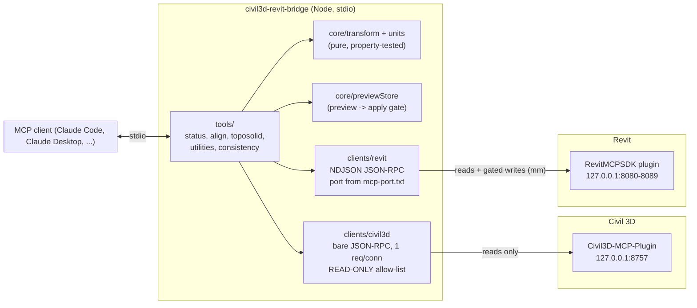

# civil3d-revit-bridge

An MCP server that connects a running **Autodesk Civil 3D** session to a running **Autodesk Revit**
session. It aligns Revit shared coordinates to the Civil 3D drawing, brings a Civil 3D surface into
Revit as a toposolid, brings site utilities into Revit as pipes, and checks the two models against each
other.

It does not replace either app's own MCP server. It talks straight to each app's in-process plugin over
localhost TCP, the same plugins that
[Civil3D-mcp](https://github.com/Sacred-G/Civil3D-mcp) and
[revit-mcp-server](https://github.com/LuDattilo/revit-mcp-server) drive.

> **Status:** v0.1.0. Verified offline against fakes of both plugins (126 tests). **It has not been
> run against live Civil 3D or Revit.** Several Revit commands it depends on are still being added to
> the Revit plugin, and three Civil 3D commands are only proposed so far (see
> [Plugin command dependencies](#plugin-command-dependencies)).

## Architecture



The same thing in ASCII:

```
MCP client --stdio--> bridge tools --> transform/units (pure)
                                   --> preview store (two-step gate)
                                   --> Civil 3D client --TCP 8757, bare JSON, READ ONLY--> Civil 3D plugin
                                   --> Revit client --TCP 8080..8089, NDJSON, mm--------> Revit plugin
```

### Coordinate frames

| frame | units | meaning |
|---|---|---|
| `civil3d` | drawing units (feet, US survey feet or meters) | Civil 3D drawing coordinates: x = easting, y = northing, z = elevation |
| `revitShared` | mm | Revit shared coordinates. **The bridge defines them as the Civil 3D drawing coordinates in mm**, so `civil3d` to `revitShared` is a pure unit scale |
| `revitInternal` | mm | Revit internal coordinates |

`revitShared = T + Rz(angle) * (revitInternal - P)`, where `P` is the anchoring internal point (usually
the origin), `T` is P's shared position (east/west, north/south, elevation) and `angle` is
`angleToTrueNorth_deg`.

**Rotation convention.** `angleToTrueNorth_deg` is a counter-clockwise rotation from the Revit internal axes
to the Civil 3D grid axes. This is the convention of Revit's `ProjectPosition.Angle` when used with
`Transform.CreateRotation(XYZ.BasisZ, angle)`. With a positive angle, Civil 3D grid north lies clockwise
(east) of Revit project north. After every apply, `bridge_align_coordinates` reads the location back from
Revit and compares it to the target. If the Revit plugin uses the opposite sign, the verification fails
and says so. The convention has **not yet been checked against live Revit**.

**Units.** Every conversion is explicit (`src/core/units.ts`). The Civil 3D plugin reports only `feet` or
`meters`: it reports US survey feet as `feet`. The bridge therefore assumes international feet (0.3048 m,
the same as Revit when it links a DWG in feet) and warns every time. Pass
`drawingUnits: "usSurveyFeet"` when the drawing really is in US survey feet. At a state-plane easting of
6,000,000 ft the two feet differ by 3.66 m. Revit's wire unit is the millimetre.

### Safety model

- **Civil 3D is only read.** The Civil 3D client refuses any method that is not on a read-only allow-list,
  and it refuses before it connects. This matters because the bridge goes straight to the plugin, which
  bypasses the approval gate in the Civil3D-mcp Node server.
- **Writes are two-step.** A write tool defaults to a *preview*. The preview writes nothing, asks Revit
  for a `dryRun` when it can, and returns a `previewId`. To write, call the tool again with the **same**
  arguments plus `apply: true` and that `previewId`. The apply step recomputes the payload from live data
  and refuses if the arguments or the data changed since the preview. A `previewId` expires after
  15 minutes and can be used only once.
- **No call writes to both apps.** Only Revit is ever written.
- **Placement guard.** If geometry would land more than about 32 km (20 miles) from Revit's internal
  origin, apply is blocked. This usually means shared coordinates have not been aligned yet.

## Tools

All lengths are in **drawing units** unless the name ends in `_mm`.

### `bridge_status` (read-only)

`{ drawingUnits?, probeCommands? = true }`

Reports:

- whether both plugins can be reached, with endpoints and how the Revit port was discovered
- Civil 3D version, drawing, units and CRS (code, zone, datum, projection)
- Revit project, levels and project location: survey point, project base point, the internal origin in
  shared and in Civil 3D coordinates, and the rotation
- which pending commands exist, found with read-only probes only

### `bridge_align_coordinates` (preview / apply)

| param | type | notes |
|---|---|---|
| `civil3dPoint` | `{pointNumber}` \| `{pointName}` \| `{northing, easting, elevation}` | base point |
| `revitInternalPoint_mm` | `{x,y,z}` | the internal point that must land on the base point; default origin |
| `rotation` | `{source:"civil3dNorth"}` (default) \| `{source:"explicit", angleToTrueNorth_deg}` \| `{source:"twoPoints", civil3dPoint, revitInternalPoint_mm, maxScaleError?=0.001}` | `twoPoints` also checks that the two pairs agree in length, which catches unit mistakes |
| `locationName` | string | passed through to Revit |
| `toleranceMm` | number = 1 | verification tolerance |
| `drawingUnits` | `feet` \| `usSurveyFeet` \| `meters` \| ... | unit override |
| `apply`, `previewId` | | two-step gate |

The preview returns the exact `set_shared_coordinates` payload and Revit's current location
(`before`). It also shows how far the target moves things, and a pure round-trip check of test points
(internal to shared to Civil 3D and back). The apply step returns `after` and a `verification`: it
reads `get_project_location` back from Revit and pushes probe points through both transforms.

### `bridge_surface_to_toposolid` (preview / apply)

| param | type | notes |
|---|---|---|
| `surfaceName` | string | Civil 3D surface |
| `sampling` | `grid` (default) \| `tin` | `tin` needs the pending `getSurfaceTinVertices` |
| `gridSpacing` | number | default: region area / maxPoints; coarsened automatically if needed |
| `boundary` | `{coordinateSystem: civil3d\|revitShared\|revitInternal, points:[{x,y}]}` | default: the surface bounding box |
| `maxPoints` | int 4..20000 = 2000 | TIN vertices are decimated by plan binning |
| `toposolidTypeName`, `levelName`, `name` | string | passed to Revit |
| `includePoints` | bool = false | include every point in the response |
| `drawingUnits`, `apply`, `previewId` | | |

Sends `create_toposolid { points_mm, coordinateSystem: "shared", ... }`.

### `bridge_utilities_to_revit` (report / preview / apply)

| param | type | notes |
|---|---|---|
| `mode` | `report` (default, read-only) \| `create` | |
| `include` | `gravity` \| `pressure` \| `both` = both | |
| `networks` | string[] | restrict to these network names |
| `boundary` | polygon | pipes touching or inside |
| `footprint` + `distance` | polygon + number | pipes within `distance` (plan) of the footprint; the footprint also drives connection points |
| `levelName` | string | required for `create` |
| `systemMapping` | `[{network?: "name" or "/regex/", kind?, systemTypeName, pipeTypeName?}]` | first match wins |
| `defaultSystemTypeName`, `defaultPipeTypeName` | string | fallback for pipes no rule matches |
| `diameterUnits` | `drawing` (default) \| `inches` \| `millimeters` | Civil 3D reports inner diameter in drawing units |
| `maxPipes` | int = 500 | |
| `drawingUnits`, `apply`, `previewId` | | |

`report` lists the selected pipes: centreline and invert at each end (invert = centreline − diameter/2),
shared-mm endpoints, and the distance to the footprint. Each pipe also gets a **connection point**: the
end nearest the building, with its location and invert. `create` sends
`create_pipe { pipes:[{start_mm, end_mm, diameter_mm, systemTypeName, pipeTypeName?, levelName}], coordinateSystem:"shared" }`
using **centreline** elevations.

### `bridge_check_consistency` (read-only)

| param | notes |
|---|---|
| `footprint` | polygon used by `ffe` and `setbacks` |
| `ffe: {surfaceName, levelName?, minAboveGrade, maxAboveGrade?, sampleSpacing?, pads?:[{name, footprint, levelName?}]}` | Revit level elevation, taken into shared coordinates, compared with surface grade sampled along the footprint perimeter. Pass when FFE − highest grade ≥ `minAboveGrade` and FFE − lowest grade ≤ `maxAboveGrade` |
| `setbacks: {parcel:{siteName, parcelName} \| parcelBoundary, default, perEdge?:[{edgeIndex, distance, label?}]}` | for each parcel edge, the minimum footprint distance against the required setback, plus a check that the footprint lies inside the parcel |
| `alignment: {civil3dPoint, revitReference: "surveyPoint" \| {internalPoint_mm}, horizontalTolerance?, verticalTolerance?}` | Revit survey point (or an internal point through the shared transform) against a Civil 3D point |

Returns `{overall: pass|fail|incomplete|skipped, checks:[{check, status, summary, details}]}`.

## Plugin command dependencies

### Civil 3D plugin (`Civil3D-MCP-Plugin`, port 8757): all read-only

**Existing:**

- `getCivil3DHealth`, `getDrawingInfo`, `getCoordinateSystemInfo`
- `getCogoPoint`, `listCogoPoints`
- `listSurfaces`, `getSurface`, `sampleSurfaceElevations` (`method: "points"`)
- `listPipeNetworks`, `getPipeNetwork`, `listPressureNetworks`, `getPressureNetworkInfo`
- `reportParcels` (`includeCoordinates: true`)

**Composed from existing commands:**

- *Gravity pipe plan geometry.* `getPipeNetwork` returns centreline start and end elevations and the
  start and end structure names, but no pipe XY. The bridge takes XY from the connected structures'
  insertion points, so pipes that lack a structure at either end are skipped and reported.
- *Surface sampling.* The grid is built in the bridge and sampled through `sampleSurfaceElevations`
  in chunks of 4,000 points. The plugin silently drops points off the surface; the bridge matches the
  results back by coordinates.
- *COGO point by name.* The bridge pages through `listCogoPoints`.

**Pending (proposed contracts; the bridge already calls them and falls back or explains when they are missing):**

| command | contract | why |
|---|---|---|
| `getSurfaceTinVertices` | `{name, boundary?:[{x,y}], maxPoints?}` → `{surfaceName, vertices:[{x,y,z}], totalVertexCount, truncated, units}` | `sampling: "tin"`; no existing command lists TIN points |
| `getParcelGeometry` | `{siteName, parcelName}` → `{name, vertices:[{x,y}], closed, units}` | `reportParcels` reads vertices through reflection (`GetBoundary`/`GetVertices`) and may return none |
| `getDrawingUnits` | `{}` → `{insunits:"Feet"\|"USSurveyFeet"\|"Meters"\|..., linearUnits}` | `linearUnits` merges US survey feet into `feet` |
| *(extension)* `getPipeNetwork` pipe data | add `startPoint:{x,y,z}`, `endPoint:{x,y,z}` (centreline) and `startInvert`, `endInvert` | removes the structure-XY approximation; the bridge already prefers these fields when present |

### Revit plugin (RevitMCPSDK, port 8080–8089)

Wire method names are the same snake_case names as the Revit MCP tools; for example, `create_level.ts`
sends `create_level`.

**Existing:** `get_project_info` (levels in mm from the internal origin).

**Pending:** being added to the Revit plugin in parallel; designed against this contract:

- `get_project_location` → `{activeLocationName, surveyPoint:{eastWest_mm,northSouth_mm,elevation_mm}, projectBasePoint:{..., angleToTrueNorth_deg}, sharedTransform:{origin_mm:{x,y,z}, rotation_deg}, siteLatitude, siteLongitude}`
- `set_shared_coordinates` `{eastWest_mm, northSouth_mm, elevation_mm, angleToTrueNorth_deg, internalPoint_mm?, locationName?, dryRun?}`
- `create_toposolid` `{points_mm:[{x,y,z}], coordinateSystem:"internal"|"shared", toposolidTypeName?, levelName?, name?, dryRun?}`
- `get_toposolids` `{includePoints?}` (status probe only)
- `create_pipe` `{pipes:[{start_mm, end_mm, diameter_mm, systemTypeName, pipeTypeName?, levelName}], coordinateSystem?, dryRun?}`
- `get_mep_systems` (advisory validation of system type names)

The bridge assumes that `sharedTransform` maps internal to shared as
`shared = origin_mm + Rz(rotation_deg) · internal`.

## Install

Requires Node 20+ (developed on Node 24).

```powershell
cd C:\dev\civil3d-automation\bridge
npm ci
npm run build
npm test
```

Register with Claude Code:

```powershell
claude mcp add civil3d-revit-bridge -s user -- node C:\dev\civil3d-automation\bridge\build\index.js
```

Both apps must be running with their MCP plugins loaded. Run `bridge_status` first.

### Environment variables

| variable | default | |
|---|---|---|
| `CIVIL3D_HOST` / `CIVIL3D_PORT` | `127.0.0.1` / `8757` | Civil 3D plugin endpoint |
| `CIVIL3D_CONNECT_TIMEOUT` / `CIVIL3D_COMMAND_TIMEOUT` | 5000 / 120000 ms | |
| `REVIT_HOST` | `127.0.0.1` | |
| `REVIT_MCP_PORT` | *(discovered)* | fixed Revit port. Otherwise the bridge uses the newest valid `%APPDATA%\Autodesk\Revit\Addins\<year>\revit_mcp_plugin\mcp-port.txt`, and falls back to 8080 |
| `REVIT_CONNECT_TIMEOUT` / `REVIT_COMMAND_TIMEOUT` | 5000 / 120000 ms | |

## Typical session

1. `bridge_status`: both reachable? Right units? Pending commands present?
2. `bridge_align_coordinates { civil3dPoint: {pointNumber: 1}, rotation: {source: "twoPoints", ...} }`
   → review → the same call again with `apply: true, previewId`.
3. `bridge_check_consistency { alignment: {civil3dPoint: {pointNumber: 1}} }`.
4. `bridge_surface_to_toposolid { surfaceName: "FG", boundary: <footprint + margin> }` → review → apply.
5. `bridge_utilities_to_revit { footprint, distance: 30 }` (report). Then `mode: "create"` with a
   `systemMapping` → review → apply.
6. `bridge_check_consistency { footprint, ffe: {...}, setbacks: {...} }`.

## Development

```
src/
  index.ts              stdio entry point
  clients/              tcpRpc (framing), civil3d, revit (port discovery)
  core/                 units, transform, geometry, previewStore (pure) + civilData, revitData (adapters)
  tools/                one file per tool + register.ts + common.ts
tests/                  vitest; see TESTING.md
```

## License

MIT, under the repository [LICENSE](../LICENSE).
